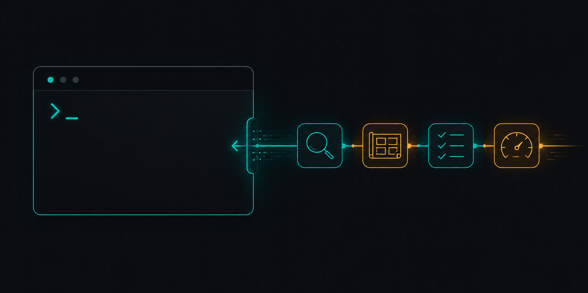

<p align="center">
  
</p>

# agent-skill-kit

**[Agent Skills](https://agentskills.io) I actually use.** Source-grounded, failure-driven, earned in real coding-agent work. Installable with the open ecosystem CLI.

```bash
npx skills add justinramos101/agent-skill-kit
```

## Quickstart

```bash
# 1. Install (picks skills interactively)
npx skills add justinramos101/agent-skill-kit

# 2. Start using — skills activate from natural language
# "audit my CLI's developer experience"    → dx-audit
# "design our API error envelope"           → dx-design
# "review this UI for anti-slop"            → ui-design
# "make our repo work with Claude Code"     → harden-repo-for-coding-agents
```

No commands to memorize. Each skill routes by intent, names its cited sources, and produces a scored, traceable result.

## Install

Pick what you need:

```bash
# Interactive — browse and choose skills
npx skills add justinramos101/agent-skill-kit

# Specific skills
npx skills add justinramos101/agent-skill-kit --skill dx-audit --skill ui-design

# An audit + design pair
npx skills add justinramos101/agent-skill-kit --skill dx-audit --skill dx-design
```

Per-agent installs (Claude Code, Cursor, Codex, Copilot, Windsurf, Aider):

```bash
npx skills add justinramos101/agent-skill-kit -a claude-code -a cursor
```

See `npx skills --help` for global vs. project scope.

## Why these skills exist

Four problems agent skills solve, and which skill to reach for:

### 1. "This surface feels wrong but I can't name why"

Your API has friction, your docs bury the answer, your tests pass but don't catch bugs.

→ **`dx-audit`**, **`docs-audit`**, **`ux-audit`**, **`writing-audit`**
Severity-scored findings, playbook-driven, cited sources. Each audit tells you *exactly* what's wrong and how to fix it.

### 2. "I need to design something new — where do I start?"

Blank canvas, no guardrails, easy to build something generic.

→ **`dx-design`**, **`docs-design`**, **`ui-design`**, **`writing-design`**
Each design skill names the good-shaped pattern, produces a concrete artifact, and carries cited heuristics so you're not guessing.

### 3. "My agent keeps making the same mistakes"

Recurring failures in CI, in PRs, in generated code — no feedback loop to capture them.

→ **`rules-from-coding-agent-failures`** (triage reflections into closure work, then promote/verify fixes)
→ **`harden-repo-for-coding-agents`** (scaffold AGENTS.md, hooks, CI gates — no eval prereq needed)
→ **`context-budget-audit`** (prune idle MCP servers, unused skills eating context tokens)

### 4. "I want a second opinion before I ship"

You trust your agent but want independent review from a different model or provider.

→ **`claude-code-cli`**, **`codex-cli`**, **`cursor-cli`**
Drive an external CLI as an independent second-opinion reviewer. Read-only by default. Reconcile findings against local evidence.

<!-- BEGIN GENERATED: pick-a-skill (scripts/build-catalog.py) -->
## Pick a skill

Two questions get you there: **which surface**, and are you **reviewing it** or **building it**?

| Surface | Review it → `-audit` | Build it → `-design` |
|---|---|---|
| **Developer experience** — APIs, SDKs, CLIs, setup, errors, auth, packaging, IDE, plugins, telemetry | `dx-audit` | `dx-design` |
| **Documentation** — READMEs, CHANGELOGs, quickstarts, API refs, contributor onboarding, samples, help centers, OpenAPI/MCP tool contracts | `docs-audit` | `docs-design` |
| **Writing** — memos/PRDs/RFCs, technical & task docs, talks/pitches, narratives, general prose | `writing-audit` | `writing-design` |
| **Product UX & accessibility** — usability, forms, navigation/IA, error/recovery, WCAG | `ux-audit` | → `ui-design` |
| **Visual UI craft** — dashboards, design systems/tokens, prototypes, motion, decks, handoff | → `ui-design` quality-review | `ui-design` |
| **Artifact ↔ host integration** — embeddable HTML artifacts: postMessage / persistence / fixed-canvas / direct-edit / export contract with an editing shell | → `ui-design` | `ui-design` (host-integration route) |
| **Minimal, modular code** — slop, duplication, over-engineering; dependency direction, deep modules; right-sizing structure so many agents can work in parallel | `minimal-modular-code` | `minimal-modular-code` |

For research and agent-facing work:

| Need | Skill |
|---|---|
| **Source-cited research** — an open-ended topic report, or validating a named opportunity to a go/no-go decision | `research` |
| **Agent as developer** — the SDK / tool / error / telemetry surface an AI agent consumes | `agent-dx` |
| **Agent as reader** — AGENTS.md, llms.txt, tool descriptions, machine-readable reference for agents | `agent-docs` |
| **Agent as end-user** — an agent-operable UI / app / computer-use surface | `agent-ux` |
| **Agent as operator** — observability, trace-and-eval loops, autonomy, reliability | `agent-ops` |
| **Agent as subject** — evals, LLM-as-judge, benchmarks, activation tests | `agent-test` |
| ↳ harden a repo for coding agents (AGENTS.md, hooks, gates, sandbox) | `harden-repo-for-coding-agents` |
| ↳ turn observed agent failures into closure work, rules, gates, or skill/eval fixes | `rules-from-coding-agent-failures` |
| **Second opinion from Codex** — drive the Codex CLI to review code/docs, give an independent take, or reflect across projects | `codex-cli` |
| **Second opinion from Claude Code** — review working-tree/branch changes, a second opinion, cross-project reflection, or a hosted ultrareview | `claude-code-cli` |
| **Second opinion from Cursor** — review or analyze under a *different* model (gpt-5, sonnet-4, …) via `cursor-agent` | `cursor-cli` |
| **Trim your agent's context budget** — audit idle MCP servers and unused plugins/skills/commands/subagents by per-session token cost, then prune safely | `context-budget-audit` |

**Still unsure?** The two boundaries people hit most:

- *"Make our docs better"* — audit existing docs → `docs-audit`; reshape docs IA → `docs-design`; API/SDK friction beyond the docs → `dx-audit`; agent-native docs (llms.txt, AGENTS.md, retrieval) → `agent-docs`.
- *"Improve our agent"* — make a coding-agent harness work in this repo (AGENTS.md, hooks, MCP) → `harden-repo-for-coding-agents`; design evals/benchmarks for an AI product → `agent-test`; operate its trace-and-eval loop, autonomy, and reliability → `agent-ops`.
<!-- END GENERATED: pick-a-skill -->

## Catalog

Every skill, grouped by family — what it does and what it's grounded in — lives in **[CATALOG.md](./CATALOG.md)**.

## Contributing

See [`CONTRIBUTING.md`](./CONTRIBUTING.md) for adding or changing a skill, the `just check` gate, and how to install a local checkout while developing. Work starts from [`AGENTS.md`](./AGENTS.md). Changes tracked in [`CHANGELOG.md`](./CHANGELOG.md).

## License

[LICENSE](./LICENSE). Individual skills may declare different terms; third-party notices live in [THIRD_PARTY.md](./THIRD_PARTY.md).