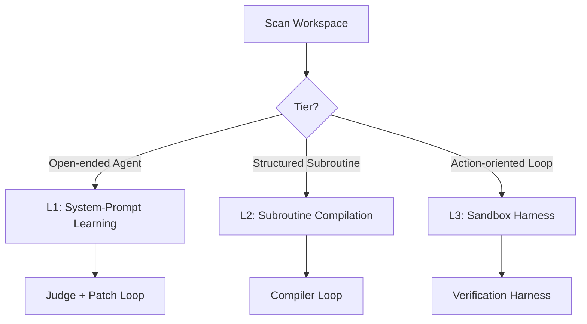

# loop-architect

`loop-architect` turns "vibe-engineered" AI applications into systematic,
metric-driven, self-improving systems. It scans the workspace, maps LLM
integrations onto the **AI Optimization Staircase**, and scaffolds
localized evaluation and optimization loops.

> **The Optimization Pivot:** stop manually rewriting prompts. Transform
> LLM inputs and workspace rules into code-level targets that can be
> measured, audited, and compiled against quantitative metrics.

## When to Use

1. **User asks to evaluate or improve an AI app:** *"Can you check how I'm
   calling OpenAI here and make it better?"* or *"How do I stop my agent
   from failing?"*
2. **User wants evals or prompt-optimizing loops:** *"Help me set up an
   eval suite"* or *"How do I connect a prompt optimizer to my project?"*
3. **Workspace contains raw, un-monitored prompt strings:** if you spot
   hardcoded prompts without metrics, offer this skill.
4. **User runs `/loop-architect`** or requests the skill by name.

## The AI Optimization Staircase

Match the optimization strategy to the execution complexity:

| Tier | Optimization Target | Best For | Verification | Tuning |
| :--- | :--- | :--- | :--- | :--- |
| **L1: System-Prompt Learning** | Markdown instruction files (`.claudemd`, `.clinerules`, `SKILL.md`) | Open-ended developer agents, chat assistants | LLM-as-a-judge critique with explanations | Meta-prompt optimizer emitting Markdown diff patches |
| **L2: Subroutine Compilation** | Bounded, stateless text-in/text-out logic in declarative signatures | Parsers, classifiers, routers, linter triagers | Structured schemas, regex validators, boolean assertions | Declarative LM compilers (`MIPROv2`, `BootstrapFewShot`) |
| **L3: Sandbox Harness** | Container execution + cost gates + permission layers | Terminal-executing agents, side-effectful tools, automated PR builders | Container isolation, test run execution, cost circuit-breakers | Deterministic handlers, iteration caps, guardrail blockers |
| **L4: System Benchmarking** | Reproducible regression suites on real-world task datasets | Backend-model swaps, platform-wide regression testing | Standardized CLI testbeds with sandboxed OSes | Terminal-bench style workloads |

## Operating Principles

1. **Decouple Body from Mind.** A harness provides physical safety, cost
   gates, and state tracking; cognitive subroutines handle linguistic
   reasoning and structured output. Never mix the two.
2. **Zero-Shot is Technical Debt.** Every hardcoded prompt in production
   without an evaluation metric is a failure waiting to happen. Move the
   developer to at least a Level 1 or Level 2 loop.

## Workflow

### Step 1 — Workspace Audit (Scan)

Locate existing AI integrations:

- API key variables (`OPENAI_API_KEY`, `ANTHROPIC_API_KEY`).
- Prompt strings in `.py`, `.ts`, `.js`, `.rs`.
- Workspace rule files (`.clinerules`, `.claudemd`, `SKILL.md`, `rules.md`).
- Existing test suites (`tests/`, `pytest.ini`, package test scripts).

### Step 2 — Diagnostic Report

Present a markdown report covering:

- **Discovered Integration Points** — where prompts live today.
- **Staircase Placement** — which tier each integration occupies (usually
  Level 0: Zero-Shot).
- **Recommended Path** — which tier to scaffold first and why.

Do not write scaffold files yet. Wait for user approval.

### Step 3 — Automated Scaffolding

On approval, create a dedicated directory (typically `ai-ops/` or
`.agents/evals/`) in the host workspace and copy + adapt the chosen
template:

- **Level 1** → `references/templates/level-1-prompt-learner.py` — for
  open-ended agents whose markdown instruction files are the target.
- **Level 2** → `references/templates/level-2-subroutine-compiler.py` —
  for stateless, structured text-in/text-out tasks. Defaults to
  `BootstrapFewShot(max_bootstrapped_demos=1)` for small (5–10) datasets;
  switch to `MIPROv2` at ~50 examples.
- **Level 3** → `references/templates/level-3-sandbox-harness.py` — for
  action-executing agents. Wires container isolation, iteration caps, and
  cost circuit-breakers.

Each template ships with a `__main__` block and TODO markers for the
host-specific wiring. Verify Python 3.10+ and the relevant SDK
(`openai`, `anthropic`, or `dspy-ai`) before instructing the user to run.

## Anti-Patterns to Avoid

- **The "God Prompt" Trap.** Do not write a single prompt that defines
  both permissions AND coding guidelines. Permissions and costs belong
  in a Level 3 Harness, not the prompt.
- **Vague Judge Prompts.** Never let an LLM-as-a-judge return a scalar
  score (`8/10`). Without natural-language explanations and structured
  failure critiques, the meta-optimizer has no signal to patch rules.
- **Heavy Frameworks First.** Start with a lean, custom `while true`
  loop. LangChain/AutoGen graphs hide runtime trace failures and stifle
  iteration.
