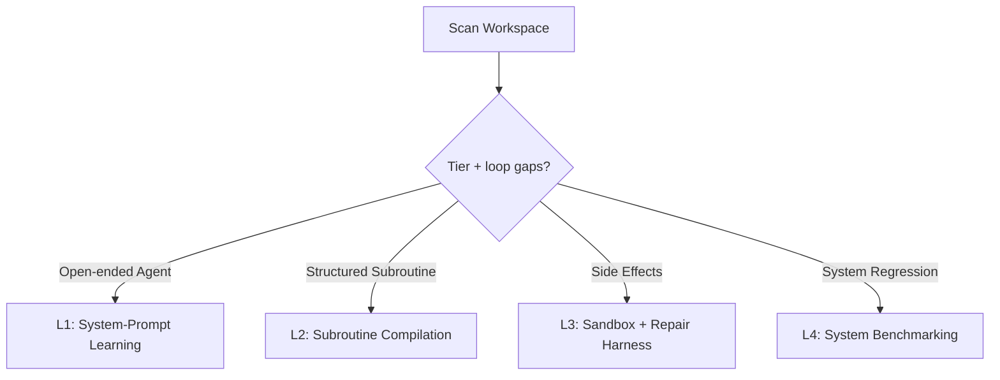

# loop-architect

`loop-architect` turns vibe-engineered AI applications into measured feedback
systems. It scans the workspace, maps integration points onto the **AI
Optimization Staircase**, scores the missing loop mechanics, and scaffolds the
smallest useful eval/optimization loop.

> **Pivot:** stop rewriting prompts by feel. Create a loop where every run
> produces a signal, the signal changes a durable artifact, and the next run
> inherits the lesson.

## When to Use

- User asks to evaluate, improve, or de-risk an AI app or agent.
- User wants evals, prompt optimization, trace replay, production signal loops,
  or system benchmarks.
- Workspace has hardcoded prompts, raw rules files, unmonitored agent loops,
  no golden set, or trace data that is not feeding improvement.
- User invokes `/loop-architect`.

## The AI Optimization Staircase

| Tier | Target | Best for | Gate before persistence |
|---|---|---|---|
| **L1: System-Prompt Learning** | `CLAUDE.md`, `AGENTS.md`, `.cursor/rules/`, `.github/copilot-instructions.md`, `.clinerules`, `SKILL.md` | Open-ended developer agents, chat assistants | Judge explanations + held-out eval + reviewed diff |
| **L2: Subroutine Compilation** | Declarative signatures | Parsers, classifiers, routers, linter triagers | Schema/assertion metric + train/test split |
| **L3: Sandbox + Repair Harness** | Container, cost, permission, verification rails | Terminal agents, PR builders, side-effectful tools | Isolation + tests + failure-to-artifact repair loop |
| **L4: System Benchmarking** | Replayable task suites | Model swaps, platform-wide regressions, release gates | Fixed benchmark + baseline comparison + rollback rule |

## Loop Readiness Matrix

In every diagnostic report, score each integration on:

1. **Signal:** traces, tests, user feedback, eval labels, cost/latency.
2. **Interpreter:** deterministic check, LLM judge, classifier, reviewer.
3. **Change surface:** prompt/rules, dataset, tool schema, harness, weights.
4. **Cadence:** local run, CI, nightly, production sample, release gate.
5. **Stop/rollback:** retry cap, held-out set, budget, rollback threshold.
6. **Owner:** engineer, AI quality lead, ops/CX, release approver.

## Workflow

### Step 1 — Workspace Audit

Locate:

- API keys and SDK calls (`OPENAI_API_KEY`, `ANTHROPIC_API_KEY`, `openai`, `anthropic`, `dspy`).
- Prompt strings, system prompts, tool descriptions, and rule files.
- Agent loops, shell/file/network side effects, iteration/cost caps, approvals.
- Existing tests, eval datasets, golden sets, benchmark scripts, CI gates.
- Traces and observability: OTel/OpenInference, Langfuse, Braintrust, Phoenix,
  LangSmith, Raindrop, custom trace tables, feedback rows, version tags.
- Production-loop signals: experiment assignment, semantic classifiers, user
  feedback, rollback dashboards, sampled live evals.

### Step 2 — Diagnostic Report

Present:

- **Discovered Integration Points** — where model behavior enters the system.
- **Staircase Placement** — current tier and recommended next tier.
- **Loop Readiness Matrix** — signal/interpreter/change/cadence/stop/owner.
- **Production Gap** — whether the local loop needs trace replay, production
  experiment metadata, semantic signals, or human review ownership.

Do not scaffold yet. Wait for user approval.

### Step 3 — Scaffolding

Only choose an L1-L4 scaffold after the readiness matrix has a signal,
interpreter, change surface, cadence, rollback rule, and owner. If the
workspace only has traces or dashboards, recommend trace-to-eval conversion
first; observability is not a tier.

Create `ai-ops/` or `.agents/evals/` and adapt the selected template:

- **L1** → `references/templates/level-1-prompt-learner.py`
- **L2** → `references/templates/level-2-subroutine-compiler.py`
- **L3** → `references/templates/level-3-sandbox-harness.py`
- **L4** → `references/templates/level-4-system-benchmark.py`

Verify Python 3.10+ and required SDKs before telling the user to run code.

## Anti-Patterns to Avoid

- **God Prompt:** permissions, costs, and side effects belong in L3 harness code.
- **Vague Judge:** scalar scores without failure explanations cannot patch rules.
- **Ungated Self-Improvement:** never auto-write learned rules without held-out
  evals, diff review, compaction/deletion policy, and privacy filtering.
- **Dashboard Theater:** traces that do not become evals, fixes, or rollback
  rules are observability, not a feedback loop.
