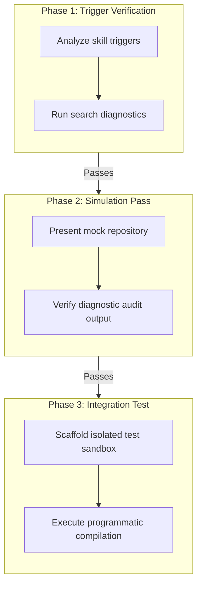

# TEST_PLAN.md — Loop Architect Test Plan

This test plan defines the validation protocol to verify that the **`loop-architect`** skill behaves reliably, executes accurate diagnostics, and scaffolds correct code templates in any target workspace.

---

> **The Verification Goal:** Ensure the agent correctly identifies AI architectural tiers, scores feedback-loop readiness, recommends appropriate optimization/evaluation steps, and writes clean, executable, local-first code scaffolds.

---



---

## Phase 1: Trigger Verification (Dry Run)

Verify that the agent successfully registers and loads the skill file (`SKILL.md`) when prompted with canonical keywords.

### 1. The Test Input
In a fresh chat session, issue one of the triggering commands:
```markdown
I want to run the /loop-architect on my workspace. Please audit it.
```

### 2. Success Criteria
* The agent displays a status line or message confirming it has loaded and is executing the `loop-architect` skill.
* The agent references the specific instruction set in `.claude/skills/loop-architect/SKILL.md` to guide its audit workflow.

---

## Phase 2: Interactive Simulation (Mock Audit)

Verify that the agent's semantic reasoning correctly categorizes LLM integration points onto the **AI Optimization Staircase**, identifies missing loop mechanics, and recommends the correct scaffolding pattern.

### 1. The Test Input
Provide the agent with a description of a mock workspace:
```markdown
Run the loop-architect on a mock workspace containing these two files:

1. `translator.py`: Features a hardcoded prompt inside a function:
   `prompt = f"Translate this text to Spanish: {text}"`
   It has zero validation, tests, or logging.

2. `agent.py`: A CLI-driven loop that reads local files, executes local shell commands via subprocess, and runs until a user stops it. It uses raw system prompts in a local `rules.md` file.

3. `observability.md`: Notes that the team has traces, thumbs-down feedback, and sampled transcripts, but no replay dataset, eval cadence, rollback threshold, or owner.

4. `release.md`: Notes that the team wants to swap the model behind the whole assistant and needs a release gate.

5. `post-readiness.md`: Notes that all six readiness fields are 6/6, but no autonomous controller exists.
```

### 2. Success Criteria
* **`translator.py` Diagnosis:** The agent identifies this as **Level 0 (Zero-Shot)** and recommends extracting it into a **Level 2 Cognitive Subroutine** (stateless, structured text-in/text-out). It proposes scaffolding a DSPy-based compiler loop.
* **`agent.py` Diagnosis:** The agent flags the high risk of un-sandboxed shell execution. It recommends a **Level 3 Sandbox + Repair Harness** (enforcing Docker isolation, iteration caps, cost circuit-breakers, verification, and failure-to-artifact logging) before any prompt optimization is run.
* **`observability.md` Diagnosis:** The agent identifies traces/feedback as raw signal, not a loop. It fills the Loop Readiness Matrix and recommends converting selected traces into replayable eval rows before optimization.
* **`release.md` Diagnosis:** The agent recommends **Level 4 System Benchmarking** with fixed tasks, baseline/current comparison, pass-rate/cost/latency thresholds, and a rollback rule.
* **`post-readiness.md` Diagnosis:** The agent says 6/6 is readiness, not autonomy, then recommends a gated controller that promotes failures, calls an optimizer for one allowlisted diff, runs evals/benchmarks, reverses failed patches, and persists only on green gates.
* **Format Compliance:** The agent's output follows the voice rules in `STYLE.md` (no conversational fluff, short declarative sentences, clear markdown tables).

---

## Phase 3: Live Integration Test (The Acid Test)

Verify that the agent can execute the audit, diagnostic, and scaffolding steps programmatically in a real, isolated workspace directory.

### 1. Setup the Test Sandbox
Create a temporary directory structure inside your repository to simulate a "vibe-engineered" project:
```bash
mkdir -p test-sandbox/src/
```

Create a mock script `test-sandbox/src/classifier.py` containing a hardcoded API call:
```python
# test-sandbox/src/classifier.py
import os
import openai

def classify_ticket(ticket_text):
    # Hardcoded prompt - Level 0 Zero-Shot
    prompt = f"Classify this support ticket as BUG, FEATURE, or BILLING: {ticket_text}"
    client = openai.OpenAI()
    response = client.chat.completions.create(
        model="gpt-4o-mini",
        messages=[{"role": "user", "content": prompt}]
    )
    return response.choices[0].message.content
```

### 2. Run the Skill on the Sandbox
Instruct the agent to execute the audit and generate the recommended scaffolding:
```markdown
Run the loop-architect on the `test-sandbox/` directory. Scaffold the recommended optimization loop.
```

### 3. Verify the Scaffolded Output
Check that the agent correctly created the `test-sandbox/ai-ops/` directory containing:
* **Evaluation Dataset (`test-sandbox/ai-ops/dataset.json`):** Containing 5–10 sample tickets with ground-truth classifications.
* **Scaffolded Script (`test-sandbox/ai-ops/compile_classifier.py`):** Containing a valid `dspy.Signature` definition, a `dspy.Predict` module, and a `MIPROv2` or `BootstrapFewShot` compiler loop.

### 4. Execute the Scaffolded Code
Run the generated script locally to verify that it executes without syntax or import errors:
```bash
python test-sandbox/ai-ops/compile_classifier.py
```

---

## Summary Checklist

- [ ] **Trigger Registration:** Activated on keyword, slash command, or `/loop-architect`.
- [ ] **Accurate Diagnostics:** Places stateless prompts in Level 2, side-effectful loops in Level 3, and release regression problems in Level 4.
- [ ] **Loop Readiness:** Reports signal, interpreter, change surface, cadence, rollback, and owner gaps.
- [ ] **Clean Scaffolding:** Writes real, syntactically correct Python/Docker files in `ai-ops/`.
- [ ] **Prompt Safeguards:** Level 1 proposes reviewed diffs and uses held-out evals; it does not auto-write learned rules.
- [ ] **Post-Readiness Action:** A 6/6 matrix produces a Next Operating Loop or controller scaffold, not a dead-end score.
- [ ] **Local-First Design:** Proposes localized, minimal, clean boilerplate rather than complex cloud-dashboard integrations.
- [ ] **Zero Prompt Bloat:** Keeps code templates separate from the host application's control flow.
- [ ] **Lints Cleanly:** The scaffolded code compiles and passes linter evaluations.
